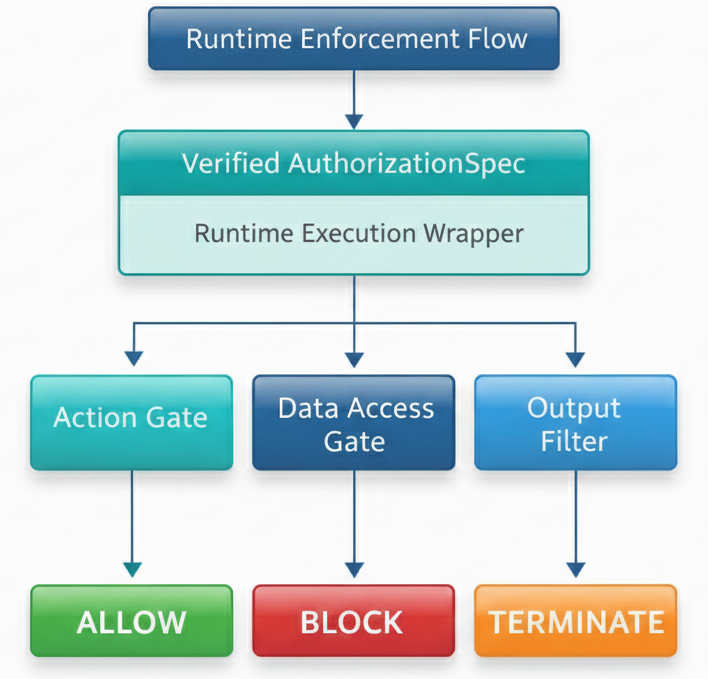

# Runtime Enforcement Layer

<p align="center">
  
</p>

<p align="center">
  <em>
    Runtime enforcement layer ensuring all executing actions remain within the
    bounds defined by the `AuthorizationSpec` and verified constraints.
  </em>
</p>

---

## Purpose

The runtime enforcement layer ensures that **execution respects authorization
boundaries in real-time**. While the verification layer performs static
checks, the runtime layer enforces the spec during execution and halts
immediately on any violations.

Key runtime responsibilities:
- Validate data access requests against `allowed_inputs`
- Validate action invocations against `permitted_actions`
- Track resource consumption (iterations, time, data)
- Immediately halt execution on violations

---

## Core Components

### MonitoredContext
Provides a constrained execution environment that intercepts:
- **Data Access**: `read_input(source_type, source_id)`
- **Action Invocation**: `perform_action(action_type, target_type)`
- **Iteration Tracking**: `tick()`

### RuntimeViolation
Exception raised when execution violates authorization boundaries; causes
immediate task termination.

### RuntimeEnforcer
Orchestrates execution:
1. Verify the `AuthorizationSpec`
2. Create a `MonitoredContext`
3. Execute the task within the context
4. Capture violations and return structured results

---

## Usage
Run the demo to observe enforcement behavior:

```bash
PYTHONPATH=src python3 -m demo.run_demo
```

