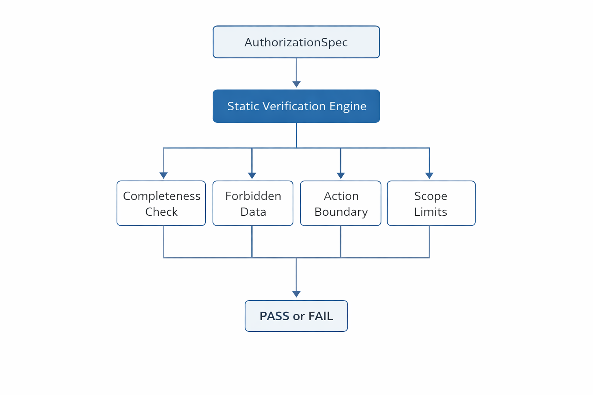

# Static Verification Layer
<p align="center">
  
</p>

<p align="center">
  <em>
    Static verification pipeline applied to an AuthorizationSpec.
    The specification is validated for completeness, forbidden data usage,
    action boundary violations, and scope boundedness prior to execution.
  </em>
</p>


## Purpose

The verification layer provides **pre-execution authorization validation** for AI systems.
Its role is to deterministically determine whether an AI system is *allowed to execute at all*
under a given authorization specification.

This layer exists to prevent a fundamental failure mode of modern AI systems:
**execution without explicit, verifiable boundaries**.

Unlike runtime monitoring, static verification occurs *before* any execution begins,
ensuring that unauthorized behavior is blocked at the semantic level rather than detected after damage has occurred.

---

## Input and Output

### Input
- A fully constructed `AuthorizationSpec` object defining:
  - Allowed data inputs
  - Forbidden data patterns
  - Permitted actions
  - Execution scope boundaries

### Output
- A deterministic verification result:
  - **PASS** — execution is authorized
  - **FAIL** — execution is prohibited
- A complete list of violations explaining *exactly* why verification failed

No probabilistic reasoning or learning-based decisions are involved.

---

## Verification Pipeline

The verification engine applies a fixed sequence of deterministic checks:

1. **Completeness Check**  
   Ensures all mandatory authorization fields are present and valid.

2. **Forbidden Data Check**  
   Ensures no explicitly forbidden data overlaps with declared allowed inputs.

3. **Action Boundary Check**  
   Ensures all actions are explicitly declared with no implicit or wildcard behavior.

4. **Scope Boundedness Check**  
   Ensures execution is finite and constrained by time, data, and resource limits.

Verification succeeds **if and only if** all checks pass.

---

## Conceptual Flow
```
AuthorizationSpec
       ↓
[CompletenessChecker] ────→ All required fields present?
       ↓ (PASS)
[ForbiddenDataChecker] ────→ No forbidden/allowed overlap?
       ↓ (PASS)
[ActionBoundaryChecker] ────→ All actions fully declared?
       ↓ (PASS)
[ScopeBoundednessChecker] ──→ Execution finite & bounded?
       ↓ (PASS)
   VERIFIED ✓
  # Static Verification Layer

  <p align="center">
    
  </p>

  <p align="center">
    <em>
      Static verification pipeline applied to an `AuthorizationSpec`. The
      specification is validated for completeness, forbidden data usage, action
      boundary violations, and scope boundedness prior to execution.
    </em>
  </p>

  ---

  ## Purpose

  The verification layer provides **pre-execution authorization validation** for
  AI systems. Its role is to deterministically determine whether an AI system is
  allowed to execute under a given authorization specification.

  This layer prevents a fundamental failure mode: **execution without explicit,
  verifiable boundaries**. Static verification runs before execution and blocks
  underspecified or unsafe specs.

  ---

  ## Input and Output

  ### Input
  - A fully constructed `AuthorizationSpec` object defining:
    - Allowed data inputs
    - Forbidden data patterns
    - Permitted actions
    - Execution scope boundaries

  ### Output
  - A deterministic verification result:
    - **PASS** — execution is authorized
    - **FAIL** — execution is prohibited
  - A list of violations explaining *exactly* why verification failed

  No probabilistic reasoning or machine-learned decisions are involved.

  ---

  ## Verification Pipeline

  The verification engine applies a fixed sequence of deterministic checks:

  1. **Completeness Check** — ensure required fields are present and explicit
  2. **Forbidden Data Check** — ensure no overlap between forbidden and allowed data
  3. **Action Boundary Check** — ensure actions are fully specified (no wildcards)
  4. **Scope Boundedness Check** — ensure execution is finite and bounded

  Verification succeeds **iff** all checks pass.

  ---

  ## Conceptual Flow

  ```
  AuthorizationSpec
         ↓
  [CompletenessChecker] ────→ All required fields present?
         ↓ (PASS)
  [ForbiddenDataChecker] ────→ No forbidden/allowed overlap?
         ↓ (PASS)
  [ActionBoundaryChecker] ────→ All actions fully declared?
         ↓ (PASS)
  [ScopeBoundednessChecker] ──→ Execution finite & bounded?
         ↓ (PASS)
     VERIFIED ✓
     → Proceed to Runtime Enforcement
  ```

  If any check fails, verification is rejected with explicit violation reasons.

